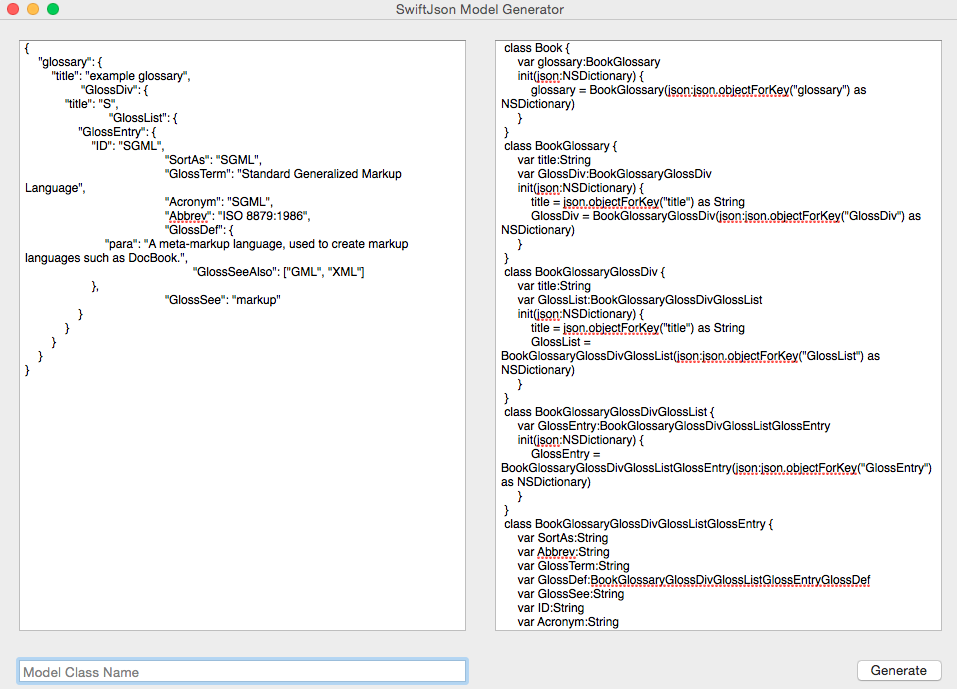

SwiftJson is an OS X application that will generate Class Models in Swift from a provided JSON file. 

 
Selecting 'Inspect First Array Element' will attempt to make a more informed cast than AnyObject by using the first element of an array.  If any array in a model contains mixed types, this box should be unchecked.
